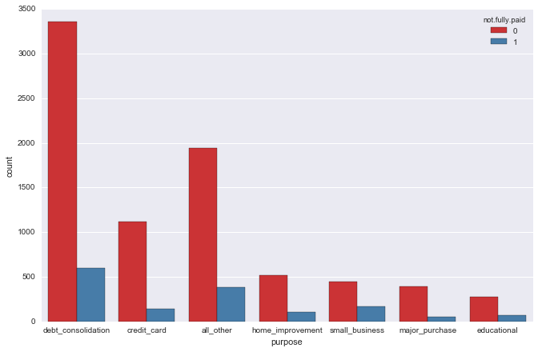

# Determining and Predicting Loan Repayment Status using Decision Trees and Random Forests

## Description

For better or for worse, loan lending and debt repayment forms the bedrock of efficient and productive allocation of economic resources in our modern financial systems. In the realm of financial institutions, determining the creditworthiness of loan applicants is crucial for minimizing default risks and maximizing profitability. This project aims to leverage the power of machine learning, specifically decision trees, to predict the repayment status of loans. To build this decision tree, I will be using lending data from peer-to-peer lending service LendingClub from the years 2007 to 2010.

## Code


```python
# imports
import pandas as pd
import numpy as np
import matplotlib.pyplot as plt
import seaborn as sns
%matplotlib inline
```

### Getting the Data


```python
loans = pd.read_csv('loan_data.csv')
```


```python
loans.head()
```


<div>
<style scoped>
    .dataframe tbody tr th:only-of-type {
        vertical-align: middle;
    }

    .dataframe tbody tr th {
        vertical-align: top;
    }

    .dataframe thead th {
        text-align: right;
    }
</style>
<table border="1" class="dataframe">
  <thead>
    <tr style="text-align: right;">
      <th></th>
      <th>credit.policy</th>
      <th>purpose</th>
      <th>int.rate</th>
      <th>installment</th>
      <th>log.annual.inc</th>
      <th>dti</th>
      <th>fico</th>
      <th>days.with.cr.line</th>
      <th>revol.bal</th>
      <th>revol.util</th>
      <th>inq.last.6mths</th>
      <th>delinq.2yrs</th>
      <th>pub.rec</th>
      <th>not.fully.paid</th>
    </tr>
  </thead>
  <tbody>
    <tr>
      <th>0</th>
      <td>1</td>
      <td>debt_consolidation</td>
      <td>0.1189</td>
      <td>829.10</td>
      <td>11.350407</td>
      <td>19.48</td>
      <td>737</td>
      <td>5639.958333</td>
      <td>28854</td>
      <td>52.1</td>
      <td>0</td>
      <td>0</td>
      <td>0</td>
      <td>0</td>
    </tr>
    <tr>
      <th>1</th>
      <td>1</td>
      <td>credit_card</td>
      <td>0.1071</td>
      <td>228.22</td>
      <td>11.082143</td>
      <td>14.29</td>
      <td>707</td>
      <td>2760.000000</td>
      <td>33623</td>
      <td>76.7</td>
      <td>0</td>
      <td>0</td>
      <td>0</td>
      <td>0</td>
    </tr>
    <tr>
      <th>2</th>
      <td>1</td>
      <td>debt_consolidation</td>
      <td>0.1357</td>
      <td>366.86</td>
      <td>10.373491</td>
      <td>11.63</td>
      <td>682</td>
      <td>4710.000000</td>
      <td>3511</td>
      <td>25.6</td>
      <td>1</td>
      <td>0</td>
      <td>0</td>
      <td>0</td>
    </tr>
    <tr>
      <th>3</th>
      <td>1</td>
      <td>debt_consolidation</td>
      <td>0.1008</td>
      <td>162.34</td>
      <td>11.350407</td>
      <td>8.10</td>
      <td>712</td>
      <td>2699.958333</td>
      <td>33667</td>
      <td>73.2</td>
      <td>1</td>
      <td>0</td>
      <td>0</td>
      <td>0</td>
    </tr>
    <tr>
      <th>4</th>
      <td>1</td>
      <td>credit_card</td>
      <td>0.1426</td>
      <td>102.92</td>
      <td>11.299732</td>
      <td>14.97</td>
      <td>667</td>
      <td>4066.000000</td>
      <td>4740</td>
      <td>39.5</td>
      <td>0</td>
      <td>1</td>
      <td>0</td>
      <td>0</td>
    </tr>
  </tbody>
</table>
</div>


```python
loans.describe()
```


<div>
<style scoped>
    .dataframe tbody tr th:only-of-type {
        vertical-align: middle;
    }

    .dataframe tbody tr th {
        vertical-align: top;
    }

    .dataframe thead th {
        text-align: right;
    }
</style>
<table border="1" class="dataframe">
  <thead>
    <tr style="text-align: right;">
      <th></th>
      <th>credit.policy</th>
      <th>int.rate</th>
      <th>installment</th>
      <th>log.annual.inc</th>
      <th>dti</th>
      <th>fico</th>
      <th>days.with.cr.line</th>
      <th>revol.bal</th>
      <th>revol.util</th>
      <th>inq.last.6mths</th>
      <th>delinq.2yrs</th>
      <th>pub.rec</th>
      <th>not.fully.paid</th>
    </tr>
  </thead>
  <tbody>
    <tr>
      <th>count</th>
      <td>9578.000000</td>
      <td>9578.000000</td>
      <td>9578.000000</td>
      <td>9578.000000</td>
      <td>9578.000000</td>
      <td>9578.000000</td>
      <td>9578.000000</td>
      <td>9.578000e+03</td>
      <td>9578.000000</td>
      <td>9578.000000</td>
      <td>9578.000000</td>
      <td>9578.000000</td>
      <td>9578.000000</td>
    </tr>
    <tr>
      <th>mean</th>
      <td>0.804970</td>
      <td>0.122640</td>
      <td>319.089413</td>
      <td>10.932117</td>
      <td>12.606679</td>
      <td>710.846314</td>
      <td>4560.767197</td>
      <td>1.691396e+04</td>
      <td>46.799236</td>
      <td>1.577469</td>
      <td>0.163708</td>
      <td>0.062122</td>
      <td>0.160054</td>
    </tr>
    <tr>
      <th>std</th>
      <td>0.396245</td>
      <td>0.026847</td>
      <td>207.071301</td>
      <td>0.614813</td>
      <td>6.883970</td>
      <td>37.970537</td>
      <td>2496.930377</td>
      <td>3.375619e+04</td>
      <td>29.014417</td>
      <td>2.200245</td>
      <td>0.546215</td>
      <td>0.262126</td>
      <td>0.366676</td>
    </tr>
    <tr>
      <th>min</th>
      <td>0.000000</td>
      <td>0.060000</td>
      <td>15.670000</td>
      <td>7.547502</td>
      <td>0.000000</td>
      <td>612.000000</td>
      <td>178.958333</td>
      <td>0.000000e+00</td>
      <td>0.000000</td>
      <td>0.000000</td>
      <td>0.000000</td>
      <td>0.000000</td>
      <td>0.000000</td>
    </tr>
    <tr>
      <th>25%</th>
      <td>1.000000</td>
      <td>0.103900</td>
      <td>163.770000</td>
      <td>10.558414</td>
      <td>7.212500</td>
      <td>682.000000</td>
      <td>2820.000000</td>
      <td>3.187000e+03</td>
      <td>22.600000</td>
      <td>0.000000</td>
      <td>0.000000</td>
      <td>0.000000</td>
      <td>0.000000</td>
    </tr>
    <tr>
      <th>50%</th>
      <td>1.000000</td>
      <td>0.122100</td>
      <td>268.950000</td>
      <td>10.928884</td>
      <td>12.665000</td>
      <td>707.000000</td>
      <td>4139.958333</td>
      <td>8.596000e+03</td>
      <td>46.300000</td>
      <td>1.000000</td>
      <td>0.000000</td>
      <td>0.000000</td>
      <td>0.000000</td>
    </tr>
    <tr>
      <th>75%</th>
      <td>1.000000</td>
      <td>0.140700</td>
      <td>432.762500</td>
      <td>11.291293</td>
      <td>17.950000</td>
      <td>737.000000</td>
      <td>5730.000000</td>
      <td>1.824950e+04</td>
      <td>70.900000</td>
      <td>2.000000</td>
      <td>0.000000</td>
      <td>0.000000</td>
      <td>0.000000</td>
    </tr>
    <tr>
      <th>max</th>
      <td>1.000000</td>
      <td>0.216400</td>
      <td>940.140000</td>
      <td>14.528354</td>
      <td>29.960000</td>
      <td>827.000000</td>
      <td>17639.958330</td>
      <td>1.207359e+06</td>
      <td>119.000000</td>
      <td>33.000000</td>
      <td>13.000000</td>
      <td>5.000000</td>
      <td>1.000000</td>
    </tr>
  </tbody>
</table>
</div>


```python
loans.info()
```

    <class 'pandas.core.frame.DataFrame'>
    RangeIndex: 9578 entries, 0 to 9577
    Data columns (total 14 columns):
     #   Column             Non-Null Count  Dtype  
    ---  ------             --------------  -----  
     0   credit.policy      9578 non-null   int64  
     1   purpose            9578 non-null   object 
     2   int.rate           9578 non-null   float64
     3   installment        9578 non-null   float64
     4   log.annual.inc     9578 non-null   float64
     5   dti                9578 non-null   float64
     6   fico               9578 non-null   int64  
     7   days.with.cr.line  9578 non-null   float64
     8   revol.bal          9578 non-null   int64  
     9   revol.util         9578 non-null   float64
     10  inq.last.6mths     9578 non-null   int64  
     11  delinq.2yrs        9578 non-null   int64  
     12  pub.rec            9578 non-null   int64  
     13  not.fully.paid     9578 non-null   int64  
    dtypes: float64(6), int64(7), object(1)
    memory usage: 1.0+ MB
    

In order to determine the loan repayment status, we are given 13 different variables from which we can train our decision tree on as well as the status the repayment s tatus of the loan. These variables are:
* credit.policy: 1 if the customer meets the credit underwriting criteria of LendingClub.com, and 0 otherwise.
* purpose: The purpose of the loan (takes values "credit_card", "debt_consolidation", "educational", "major_purchase", "small_business", and "all_other").
* int.rate: The interest rate of the loan, as a proportion (a rate of 11% would be stored as 0.11). Borrowers judged by LendingClub.com to be more risky are assigned higher interest rates.
* installment: The monthly installments owed by the borrower if the loan is funded.
* log.annual.inc: The natural log of the self-reported annual income of the borrower.
* dti: The debt-to-income ratio of the borrower (amount of debt divided by annual income).
* fico: The FICO credit score of the borrower.
* days.with.cr.line: The number of days the borrower has had a credit line.
* revol.bal: The borrower's revolving balance (amount unpaid at the end of the credit card billing cycle).
* revol.util: The borrower's revolving line utilization rate (the amount of the credit line used relative to total credit available).
* inq.last.6mths: The borrower's number of inquiries by creditors in the last 6 months.
* delinq.2yrs: The number of times the borrower had been 30+ days past due on a payment in the past 2 years.
* pub.rec: The borrower's number of derogatory public records (bankruptcy filings, tax liens, or judgments).

### Exploratory Data Analysis


```python
plt.figure(figsize=(10,6))
loans[loans['credit.policy']==1]['fico'].hist(alpha=0.5,color='blue',
                                              bins=30,label='Credit.Policy=1')
loans[loans['credit.policy']==0]['fico'].hist(alpha=0.5,color='red',
                                              bins=30,label='Credit.Policy=0')
plt.legend()
plt.xlabel('FICO')
```


    Text(0.5, 0, 'FICO')


    

    


From this histogram, we can see that credit policy was more often given to borrowers with higher FICO scores, while seldom given to borrowers with lower FICO scores. This matches up with our intuition that people with higher FICO scores, a number indicating credit trustworthiness, would be given the credit policy given to people borrowers who meet the underwriting criteria of LendingClub.


```python
plt.figure(figsize=(10,6))
loans[loans['not.fully.paid']==1]['fico'].hist(alpha=0.5,color='blue',
                                              bins=30,label='not.fully.paid=1')
loans[loans['not.fully.paid']==0]['fico'].hist(alpha=0.5,color='red',
                                              bins=30,label='not.fully.paid=0')
plt.legend()
plt.xlabel('FICO')
```


    Text(0.5, 0, 'FICO')


    

    


```python
plt.figure(figsize=(12,7))
sns.countplot(x='purpose',hue='not.fully.paid',data=loans,palette='Set1')
```


    ---------------------------------------------------------------------------

    AttributeError                            Traceback (most recent call last)

    Cell In[11], line 2
          1 plt.figure(figsize=(12,7))
    ----> 2 sns.countplot(x='purpose',hue='not.fully.paid',data=loans,palette='Set1')
    

    File c:\Users\justi\anaconda3\Lib\site-packages\seaborn\categorical.py:2955, in countplot(data, x, y, hue, order, hue_order, orient, color, palette, saturation, width, dodge, ax, **kwargs)
       2952 if ax is None:
       2953     ax = plt.gca()
    -> 2955 plotter.plot(ax, kwargs)
       2956 return ax
    

    File c:\Users\justi\anaconda3\Lib\site-packages\seaborn\categorical.py:1587, in _BarPlotter.plot(self, ax, bar_kws)
       1585 """Make the plot."""
       1586 self.draw_bars(ax, bar_kws)
    -> 1587 self.annotate_axes(ax)
       1588 if self.orient == "h":
       1589     ax.invert_yaxis()
    

    File c:\Users\justi\anaconda3\Lib\site-packages\seaborn\categorical.py:767, in _CategoricalPlotter.annotate_axes(self, ax)
        764     ax.set_ylim(-.5, len(self.plot_data) - .5, auto=None)
        766 if self.hue_names is not None:
    --> 767     ax.legend(loc="best", title=self.hue_title)
    

    File c:\Users\justi\anaconda3\Lib\site-packages\matplotlib\axes\_axes.py:322, in Axes.legend(self, *args, **kwargs)
        204 @_docstring.dedent_interpd
        205 def legend(self, *args, **kwargs):
        206     """
        207     Place a legend on the Axes.
        208 
       (...)
        320     .. plot:: gallery/text_labels_and_annotations/legend.py
        321     """
    --> 322     handles, labels, kwargs = mlegend._parse_legend_args([self], *args, **kwargs)
        323     self.legend_ = mlegend.Legend(self, handles, labels, **kwargs)
        324     self.legend_._remove_method = self._remove_legend
    

    File c:\Users\justi\anaconda3\Lib\site-packages\matplotlib\legend.py:1361, in _parse_legend_args(axs, handles, labels, *args, **kwargs)
       1357     handles = [handle for handle, label
       1358                in zip(_get_legend_handles(axs, handlers), labels)]
       1360 elif len(args) == 0:  # 0 args: automatically detect labels and handles.
    -> 1361     handles, labels = _get_legend_handles_labels(axs, handlers)
       1362     if not handles:
       1363         log.warning(
       1364             "No artists with labels found to put in legend.  Note that "
       1365             "artists whose label start with an underscore are ignored "
       1366             "when legend() is called with no argument.")
    

    File c:\Users\justi\anaconda3\Lib\site-packages\matplotlib\legend.py:1291, in _get_legend_handles_labels(axs, legend_handler_map)
       1289 for handle in _get_legend_handles(axs, legend_handler_map):
       1290     label = handle.get_label()
    -> 1291     if label and not label.startswith('_'):
       1292         handles.append(handle)
       1293         labels.append(label)
    

    AttributeError: 'numpy.int64' object has no attribute 'startswith'


    

    


```python
sns.jointplot(x='fico',y='int.rate',data=loans,color='purple')
```

    c:\Users\justi\anaconda3\Lib\site-packages\seaborn\_oldcore.py:1119: FutureWarning: use_inf_as_na option is deprecated and will be removed in a future version. Convert inf values to NaN before operating instead.
      with pd.option_context('mode.use_inf_as_na', True):
    c:\Users\justi\anaconda3\Lib\site-packages\seaborn\_oldcore.py:1119: FutureWarning: use_inf_as_na option is deprecated and will be removed in a future version. Convert inf values to NaN before operating instead.
      with pd.option_context('mode.use_inf_as_na', True):
    


    <seaborn.axisgrid.JointGrid at 0x1d2e884e150>


    

    


```python
plt.figure(figsize=(11,7))
sns.lmplot(y='int.rate',x='fico',data=loans,hue='credit.policy', col='not.fully.paid',palette='Set1')
```


    <seaborn.axisgrid.FacetGrid at 0x1d2e923a610>


    <Figure size 1100x700 with 0 Axes>


    

    


### Setting up the Data

Since our purpose column is categorical data, we will need to transform this data to in order to train on this data. To do this, we will be using dummy variables.


```python
cat_feats = ["purpose"]
```


```python
final_data = pd.get_dummies(loans,columns=cat_feats,drop_first=True)
```

### Training the Decision Tree


```python
from sklearn.model_selection import train_test_split
X = final_data.drop('not.fully.paid',axis=1)
y = final_data['not.fully.paid']
X_train, X_test, y_train, y_test = train_test_split(X, y, test_size=0.30, random_state=101)
```


```python
from sklearn.tree import DecisionTreeClassifier
dtree = DecisionTreeClassifier()
dtree.fit(X_train,y_train)
```


<style>#sk-container-id-1 {color: black;}#sk-container-id-1 pre{padding: 0;}#sk-container-id-1 div.sk-toggleable {background-color: white;}#sk-container-id-1 label.sk-toggleable__label {cursor: pointer;display: block;width: 100%;margin-bottom: 0;padding: 0.3em;box-sizing: border-box;text-align: center;}#sk-container-id-1 label.sk-toggleable__label-arrow:before {content: "▸";float: left;margin-right: 0.25em;color: #696969;}#sk-container-id-1 label.sk-toggleable__label-arrow:hover:before {color: black;}#sk-container-id-1 div.sk-estimator:hover label.sk-toggleable__label-arrow:before {color: black;}#sk-container-id-1 div.sk-toggleable__content {max-height: 0;max-width: 0;overflow: hidden;text-align: left;background-color: #f0f8ff;}#sk-container-id-1 div.sk-toggleable__content pre {margin: 0.2em;color: black;border-radius: 0.25em;background-color: #f0f8ff;}#sk-container-id-1 input.sk-toggleable__control:checked~div.sk-toggleable__content {max-height: 200px;max-width: 100%;overflow: auto;}#sk-container-id-1 input.sk-toggleable__control:checked~label.sk-toggleable__label-arrow:before {content: "▾";}#sk-container-id-1 div.sk-estimator input.sk-toggleable__control:checked~label.sk-toggleable__label {background-color: #d4ebff;}#sk-container-id-1 div.sk-label input.sk-toggleable__control:checked~label.sk-toggleable__label {background-color: #d4ebff;}#sk-container-id-1 input.sk-hidden--visually {border: 0;clip: rect(1px 1px 1px 1px);clip: rect(1px, 1px, 1px, 1px);height: 1px;margin: -1px;overflow: hidden;padding: 0;position: absolute;width: 1px;}#sk-container-id-1 div.sk-estimator {font-family: monospace;background-color: #f0f8ff;border: 1px dotted black;border-radius: 0.25em;box-sizing: border-box;margin-bottom: 0.5em;}#sk-container-id-1 div.sk-estimator:hover {background-color: #d4ebff;}#sk-container-id-1 div.sk-parallel-item::after {content: "";width: 100%;border-bottom: 1px solid gray;flex-grow: 1;}#sk-container-id-1 div.sk-label:hover label.sk-toggleable__label {background-color: #d4ebff;}#sk-container-id-1 div.sk-serial::before {content: "";position: absolute;border-left: 1px solid gray;box-sizing: border-box;top: 0;bottom: 0;left: 50%;z-index: 0;}#sk-container-id-1 div.sk-serial {display: flex;flex-direction: column;align-items: center;background-color: white;padding-right: 0.2em;padding-left: 0.2em;position: relative;}#sk-container-id-1 div.sk-item {position: relative;z-index: 1;}#sk-container-id-1 div.sk-parallel {display: flex;align-items: stretch;justify-content: center;background-color: white;position: relative;}#sk-container-id-1 div.sk-item::before, #sk-container-id-1 div.sk-parallel-item::before {content: "";position: absolute;border-left: 1px solid gray;box-sizing: border-box;top: 0;bottom: 0;left: 50%;z-index: -1;}#sk-container-id-1 div.sk-parallel-item {display: flex;flex-direction: column;z-index: 1;position: relative;background-color: white;}#sk-container-id-1 div.sk-parallel-item:first-child::after {align-self: flex-end;width: 50%;}#sk-container-id-1 div.sk-parallel-item:last-child::after {align-self: flex-start;width: 50%;}#sk-container-id-1 div.sk-parallel-item:only-child::after {width: 0;}#sk-container-id-1 div.sk-dashed-wrapped {border: 1px dashed gray;margin: 0 0.4em 0.5em 0.4em;box-sizing: border-box;padding-bottom: 0.4em;background-color: white;}#sk-container-id-1 div.sk-label label {font-family: monospace;font-weight: bold;display: inline-block;line-height: 1.2em;}#sk-container-id-1 div.sk-label-container {text-align: center;}#sk-container-id-1 div.sk-container {/* jupyter's `normalize.less` sets `[hidden] { display: none; }` but bootstrap.min.css set `[hidden] { display: none !important; }` so we also need the `!important` here to be able to override the default hidden behavior on the sphinx rendered scikit-learn.org. See: https://github.com/scikit-learn/scikit-learn/issues/21755 */display: inline-block !important;position: relative;}#sk-container-id-1 div.sk-text-repr-fallback {display: none;}</style><div id="sk-container-id-1" class="sk-top-container"><div class="sk-text-repr-fallback"><pre>DecisionTreeClassifier()</pre><b>In a Jupyter environment, please rerun this cell to show the HTML representation or trust the notebook. <br />On GitHub, the HTML representation is unable to render, please try loading this page with nbviewer.org.</b></div><div class="sk-container" hidden><div class="sk-item"><div class="sk-estimator sk-toggleable"><input class="sk-toggleable__control sk-hidden--visually" id="sk-estimator-id-1" type="checkbox" checked><label for="sk-estimator-id-1" class="sk-toggleable__label sk-toggleable__label-arrow">DecisionTreeClassifier</label><div class="sk-toggleable__content"><pre>DecisionTreeClassifier()</pre></div></div></div></div></div>


### Predictions and Evaluation of Decision Tree


```python
predictions = dtree.predict(X_test)
```


```python
y_test.value_counts()
```


    not.fully.paid
    0    2431
    1     443
    Name: count, dtype: int64


```python
from sklearn.metrics import classification_report, confusion_matrix, ConfusionMatrixDisplay 
```


```python
print(classification_report(y_test,predictions))
```

                  precision    recall  f1-score   support
    
               0       0.86      0.82      0.84      2431
               1       0.20      0.25      0.22       443
    
        accuracy                           0.73      2874
       macro avg       0.53      0.53      0.53      2874
    weighted avg       0.76      0.73      0.74      2874
    
    


```python
disp = ConfusionMatrixDisplay(confusion_matrix(y_test,predictions))
disp.plot() 
plt.show()
```


    

    


Using this decision tree model, we can see that it struggles seems to struggle with predicting a lot with false positives, having almost as many false positives total as there are positive values in the testing data split. With an accuracy of 73%, there is some room for improvement. Let's see what happens if we incorporate Random Forests.

### Retraining Model Using Random Forests


```python
from sklearn.ensemble import RandomForestClassifier
rfc = RandomForestClassifier(n_estimators=600)
rfc.fit(X_train,y_train)
```


<style>#sk-container-id-2 {color: black;}#sk-container-id-2 pre{padding: 0;}#sk-container-id-2 div.sk-toggleable {background-color: white;}#sk-container-id-2 label.sk-toggleable__label {cursor: pointer;display: block;width: 100%;margin-bottom: 0;padding: 0.3em;box-sizing: border-box;text-align: center;}#sk-container-id-2 label.sk-toggleable__label-arrow:before {content: "▸";float: left;margin-right: 0.25em;color: #696969;}#sk-container-id-2 label.sk-toggleable__label-arrow:hover:before {color: black;}#sk-container-id-2 div.sk-estimator:hover label.sk-toggleable__label-arrow:before {color: black;}#sk-container-id-2 div.sk-toggleable__content {max-height: 0;max-width: 0;overflow: hidden;text-align: left;background-color: #f0f8ff;}#sk-container-id-2 div.sk-toggleable__content pre {margin: 0.2em;color: black;border-radius: 0.25em;background-color: #f0f8ff;}#sk-container-id-2 input.sk-toggleable__control:checked~div.sk-toggleable__content {max-height: 200px;max-width: 100%;overflow: auto;}#sk-container-id-2 input.sk-toggleable__control:checked~label.sk-toggleable__label-arrow:before {content: "▾";}#sk-container-id-2 div.sk-estimator input.sk-toggleable__control:checked~label.sk-toggleable__label {background-color: #d4ebff;}#sk-container-id-2 div.sk-label input.sk-toggleable__control:checked~label.sk-toggleable__label {background-color: #d4ebff;}#sk-container-id-2 input.sk-hidden--visually {border: 0;clip: rect(1px 1px 1px 1px);clip: rect(1px, 1px, 1px, 1px);height: 1px;margin: -1px;overflow: hidden;padding: 0;position: absolute;width: 1px;}#sk-container-id-2 div.sk-estimator {font-family: monospace;background-color: #f0f8ff;border: 1px dotted black;border-radius: 0.25em;box-sizing: border-box;margin-bottom: 0.5em;}#sk-container-id-2 div.sk-estimator:hover {background-color: #d4ebff;}#sk-container-id-2 div.sk-parallel-item::after {content: "";width: 100%;border-bottom: 1px solid gray;flex-grow: 1;}#sk-container-id-2 div.sk-label:hover label.sk-toggleable__label {background-color: #d4ebff;}#sk-container-id-2 div.sk-serial::before {content: "";position: absolute;border-left: 1px solid gray;box-sizing: border-box;top: 0;bottom: 0;left: 50%;z-index: 0;}#sk-container-id-2 div.sk-serial {display: flex;flex-direction: column;align-items: center;background-color: white;padding-right: 0.2em;padding-left: 0.2em;position: relative;}#sk-container-id-2 div.sk-item {position: relative;z-index: 1;}#sk-container-id-2 div.sk-parallel {display: flex;align-items: stretch;justify-content: center;background-color: white;position: relative;}#sk-container-id-2 div.sk-item::before, #sk-container-id-2 div.sk-parallel-item::before {content: "";position: absolute;border-left: 1px solid gray;box-sizing: border-box;top: 0;bottom: 0;left: 50%;z-index: -1;}#sk-container-id-2 div.sk-parallel-item {display: flex;flex-direction: column;z-index: 1;position: relative;background-color: white;}#sk-container-id-2 div.sk-parallel-item:first-child::after {align-self: flex-end;width: 50%;}#sk-container-id-2 div.sk-parallel-item:last-child::after {align-self: flex-start;width: 50%;}#sk-container-id-2 div.sk-parallel-item:only-child::after {width: 0;}#sk-container-id-2 div.sk-dashed-wrapped {border: 1px dashed gray;margin: 0 0.4em 0.5em 0.4em;box-sizing: border-box;padding-bottom: 0.4em;background-color: white;}#sk-container-id-2 div.sk-label label {font-family: monospace;font-weight: bold;display: inline-block;line-height: 1.2em;}#sk-container-id-2 div.sk-label-container {text-align: center;}#sk-container-id-2 div.sk-container {/* jupyter's `normalize.less` sets `[hidden] { display: none; }` but bootstrap.min.css set `[hidden] { display: none !important; }` so we also need the `!important` here to be able to override the default hidden behavior on the sphinx rendered scikit-learn.org. See: https://github.com/scikit-learn/scikit-learn/issues/21755 */display: inline-block !important;position: relative;}#sk-container-id-2 div.sk-text-repr-fallback {display: none;}</style><div id="sk-container-id-2" class="sk-top-container"><div class="sk-text-repr-fallback"><pre>RandomForestClassifier(n_estimators=600)</pre><b>In a Jupyter environment, please rerun this cell to show the HTML representation or trust the notebook. <br />On GitHub, the HTML representation is unable to render, please try loading this page with nbviewer.org.</b></div><div class="sk-container" hidden><div class="sk-item"><div class="sk-estimator sk-toggleable"><input class="sk-toggleable__control sk-hidden--visually" id="sk-estimator-id-2" type="checkbox" checked><label for="sk-estimator-id-2" class="sk-toggleable__label sk-toggleable__label-arrow">RandomForestClassifier</label><div class="sk-toggleable__content"><pre>RandomForestClassifier(n_estimators=600)</pre></div></div></div></div></div>


```python
predictions = rfc.predict(X_test)
```


```python
print(classification_report(y_test, predictions))
disp = ConfusionMatrixDisplay(confusion_matrix(y_test, predictions))
disp.plot() 
plt.show()
```

                  precision    recall  f1-score   support
    
               0       0.85      1.00      0.92      2431
               1       0.59      0.02      0.04       443
    
        accuracy                           0.85      2874
       macro avg       0.72      0.51      0.48      2874
    weighted avg       0.81      0.85      0.78      2874
    
    


    

    


### Conclusion

As we can see, using Random Forests yielded us an accuracy of 85%. Although this is better than using just a Decision Tree, this accuracy seems to have come from the model predicting nearly every label to be a negative label of 0, with the model only predicting 17 positive labels out of 443 true positive labels, with only 10 of those 17 being true positives. And with loan lenders looking to be as conservative as possible to minimize risk as lona defualts can lead to financial disaster, this Random Forest Decision Tree Model would not be the right tool for predicting loan repayments. To improve this model, there needs to be more feature engineering.
